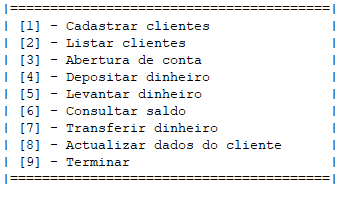

# sig-BAI

Este documento também está disponível em [Inglês](../README.md).

## O que é

Trata-se de uma simulação de um sistema de gestão para um banco angolano: [BAI (Banco Angolano de Investimentos)](https://www.bancobai.ao/pt/particulares).

## Motivação

A motivação para este repositório é um projeto escolar onde o objetivo é simular algumas das operações feitas no BAI utilizando conceitos de algoritmos. Isto é feito em portugol, uma sintaxe de algoritmo semelhante ao português. Isto é apenas para fins educacionais e não pode ou não deve ser usado na produção.

## Especificações

1. O sistema precisa ser capaz de armazenar dados em memória fazendo uso de arrays, e também precisa aplicar todos os conceitos relacionados aos algoritmos que foram aprendidos.

2. Deve ter as seguintes funcionalidades:

   - Cadastro de cliente
   - Criação de conta bancária
   - Depósito de dinheiro
   - Levantamento
   - Verificar saldo
   - Transferir dinheiro
   - Atualizar informações pessoais
   - Listar clientes
   - Cópia de segurança
   - E restauração

3. Deve fornecer ao usuário um menu para escolher entre as funcionalidades acima. Algo assim:

## Como testar

Você deverá ter o SPA Pro instalado ou algum outro programa que reconheça essa sintaxe do portugol. Para executar o programa, entre na pasta, clique no arquivo **solução.alg** e opte por executá-lo com SPA Pro (ou equivalente).

### Contribuir

Se você encontrar um bug, abra uma issue na [seção de issues deste repositório](https://github.com/isaf2022/sig-BAI/issues) no Github, ou você pode abrir um [pull request](https://github.com/isaf2022/sig-BAI/pulls) para sugerir modificações e melhorias.
